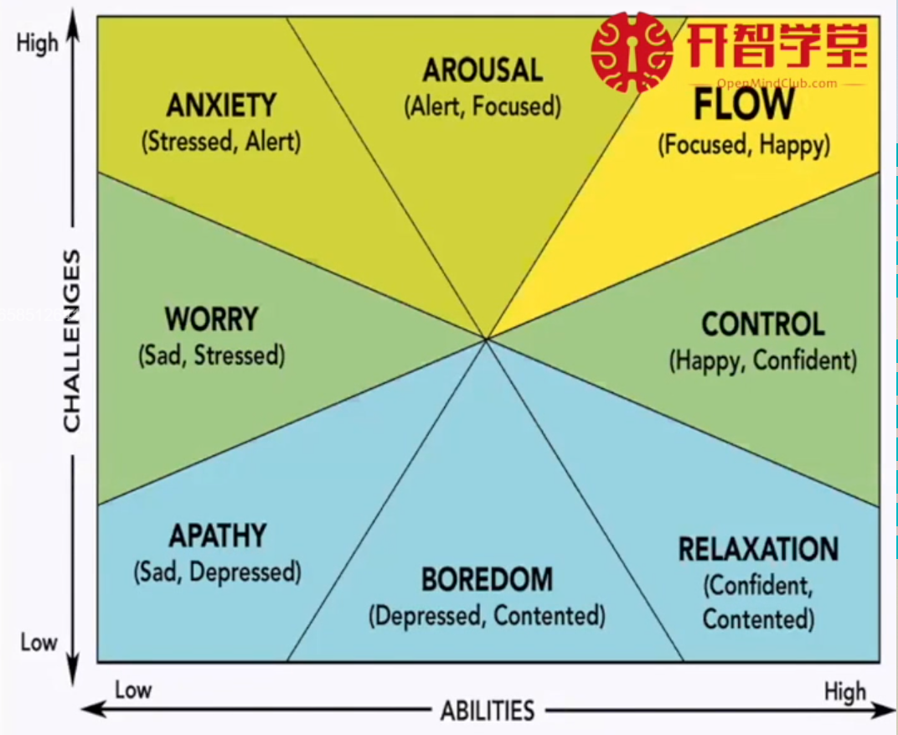

其实目前最大的问题可能是
<!--more-->
>感情上的，感觉自己对人际关系的处理极其稚嫩，觉得无聊又找不到一起玩的人，找到了一起玩的人又担心不长久，所以这就是伴侣的意义吗？科研的和社会的，终究不同，比如，在科研上的狂妄应该是不可以施加到正常的人际相处的吧。
所以要去远方吗？即使去了更远的地方，我能有什么内在的改变吗？为什么黄金屋在前，我不好好学习呢？其次，是科研不够专心。这是问题一带来的后患。最后就是随之而来的紧张和身体不适。所以最后继续放如下大纲，不断提醒自己去反思：
> - 高效休息（运动和睡眠，饮食）：抗压能力、复原能力、幸福感（心理建设）
> - 高效学习和工作（学习新知识和总结回顾）：阅读，主题学习
> - 有效社交（社会动物的情感需求）：亲密关系+实际效用

## 心流

进入心流的条件：
1. 有明确目标和进展的活动
2. 有清晰及时的**反馈**
4. 对自己完成任务能力有**信心**
3. 感知的技能水平与任务挑战匹配平衡
做之前问：
我的目标是什么？我要怎么做才能达到目标？
我的预期结果是什么？如何评估我的结果？
我要如何提高自己的能力去匹配这个任务？实验技能？知识？
坚定地做下去，保持有趣

## 高效休息
1. 休息的方法论
2.

## 高效学习和工作

## 有效社交
